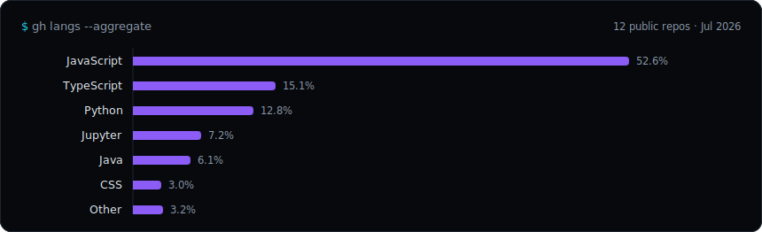

<p align="center">
  <a href="https://johnandrei.vercel.app"></a>
  <a href="https://linkedin.com/in/john-andrei-martinez-499a0b343"></a>
  <a href="mailto:martinezjandrei8425@gmail.com"></a>
</p>

AI/ML engineer specializing in **agentic AI, RAG, and applied ML** — I build systems end-to-end (data → model → eval → deployed product), not notebooks. CS undergrad, open to **AI/ML Engineering & Data Analytics** roles.

```text
$ ps aux | grep now
```

- 🔭 **Working on** — ML Engineering internship @ FlyRank AI · extending [YODA](https://github.com/Zeref538/yoda), my local data-cleaning agent
- 🌱 **Learning** — Azure AI Engineer Associate (AI-102) · agent evaluation & benchmarking
- 💬 **Ask me about** — local-first agents with Ollama, RAG pipelines on Azure OpenAI, honest ML evals

```text
$ ls projects/ --sort=flagship   # metrics are real, demos are live
```

| project | what it is | metric |
|---|---|---|
| **[YODA](https://github.com/Zeref538/yoda)** · [demo](https://zeref538.github.io/yoda/demo/) | Fully local data-cleaning agent — the LLM never sees a raw row | `96.4% fix · 0.00% false-fix` |
| **[Aegix AI](https://github.com/Zeref538/aegix-ai)** · [demo](https://aegix-ai-zeref.vercel.app) | RAG contract screening vs the PH Labor Code, cited verdicts | `84.5% verdict accuracy` |
| **[Hangin'](https://github.com/Zeref538/hangin)** · [demo](https://hangin-zeref.vercel.app) | PM2.5 forecasting for 5 PH metros, 1–24h ahead | `+15–23% MAE vs naive` |
| **[ACRA](https://github.com/Zeref538/ACRA)** · [demo](https://acra-sandy.vercel.app/dashboard) | Thesis: YOLOv8 signage re-encoding for color vision deficiency | `0.740 mAP50` |
| **[Solmara](https://github.com/Zeref538/Solmara-Resort)** · [demo](https://solmara-resort-zeref.vercel.app) | Resort platform: RAG concierge + live Stripe booking | `AI concierge + booking` |

```text
$ cat stack.txt   # what I actually ship with
```

**Core** — Python · PyTorch · scikit-learn · LangChain · Ollama &nbsp;|&nbsp; **Product** — TypeScript · React · FastAPI · Node.js &nbsp;|&nbsp; **Cloud** — Azure OpenAI · MongoDB Atlas · Vercel

**Certs** — Google AI Pro · Google Advanced Data Analytics · AWS AI Practitioner · OCI AI Foundations · CCST Cybersecurity



<p align="center">
  
  
</p>
